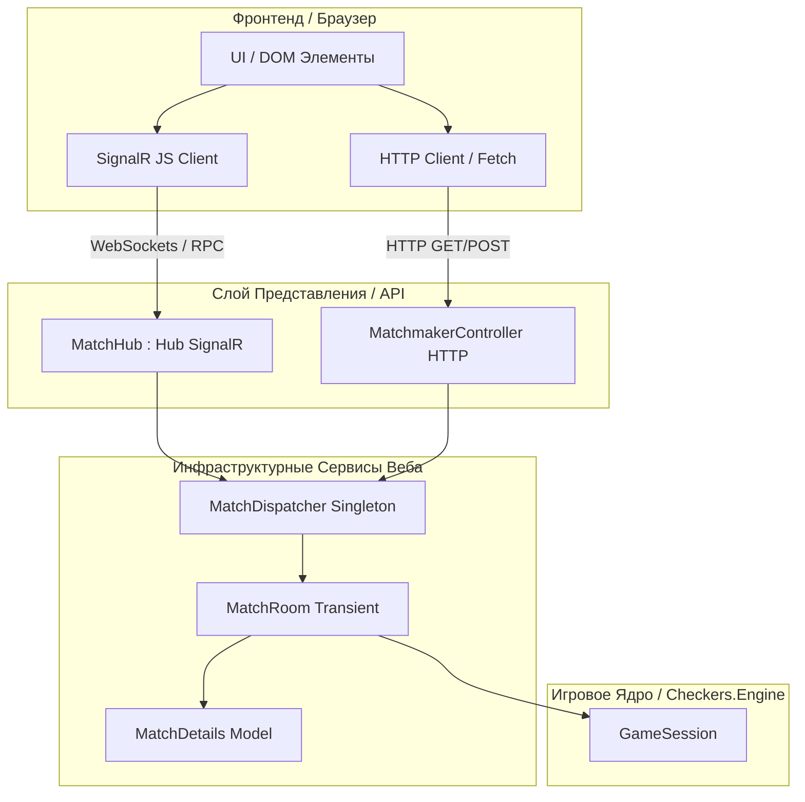
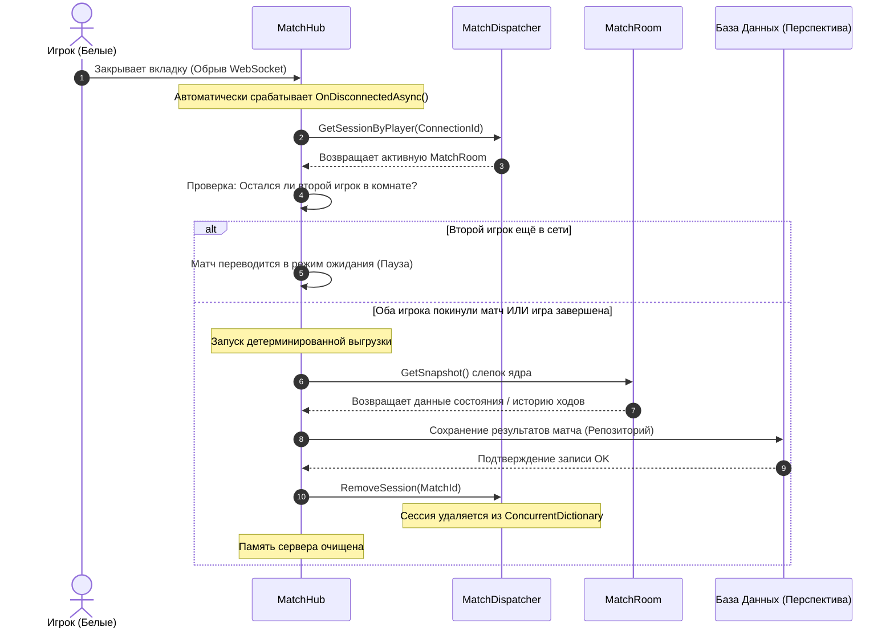

# 📑 Сопроводительный документ разработки сервиса

Этот документ — рабочая памятка и результат мозгового штурма по архитектуре сетевого слоя проекта Checkers. Сюда собираются утвержденные термины, схемы взаимодействия, варианты инфраструктурных решений и другие технические наброски, помогающие зафиксировать и структурировать идеи в процессе разработки.

---

## 🧭 1. Системная таблица терминов

| Понятие в бизнес-логике | Утвержденный термин | Зона ответственности и описание |
| :--- | :--- | :--- |
| **Игровая партия (Процесс)** | **Match** | Весь жизненный цикл от момента посадки игроков за стол до фиксации победы и выгрузки результатов в БД. |
| **Паспорт матча (Данные)** | **MatchDetails** | Чистая сущность данных («мешок со свойствами»). Хранит ID и данные участников. Прямая проекция будущей таблицы БД. |
| **Сетевой игрок / Участник** | **MatchParticipant** | Сетевой паспорт пользователя. Связывает ID из базы данных (`UserId`) и временный сетевой адрес (`ConnectionId`). |
| **Комната матча** | **MatchRoom** | Класс-фасад конкретной партии. Полностью прячет в себе логику ядра `GameSession`, защищая его от прямого внешнего вмешательства. |
| **Пул активных матчей** | **MatchDispatcher(ActiveMatchPool)** | Потокобезопасный диспетчер (`Singleton`), управляющий пулом живых комнат в оперативной памяти сервера. |
| **Комната ожидания** | **Lobby** | *Общее понятие* места, где игроки находятся *до* начала матча (выбор цветов, голосование за правила, чат). |
| **Организатор матчей (HTTP)** | **Matchmaker** | *Общее понятие* сущности, обрабатывающей дешевые первичные запросы организации комнат (класс в коде: `MatchmakerController`). |
| **Сетевой шлюз (SignalR)** | **MatchHub** | Презентационный слой реального времени. Работает как «тупой почтальон» для пересылки ходов по WebSockets во время матча. |

---

## 📊 2. Схемы архитектуры взаимодействия

### Граф системной топологии компонентов

Схема демонстрирует разделение обязанностей и прохождение пакетов через HTTP и WebSocket шлюзы.

### Событийный Lifecycle детерминированного завершения матча

Схема описывает процесс фиксации обрыва связи и безопасной очистки оперативной памяти сервера.

---

## 📂 3. Подробное описание сущностей и сигнатур

### 💾 Слой 1: Models & Entities (Чистые данные)

#### Класс `MatchDetails`
Служит изолированным контейнером метаинформации о матче. Класс избавлен от любого игрового контекста и ориентирован на последующий маппинг в таблицы реляционных баз данных.
*   `string MatchId { get; }` — Уникальный короткий строковый ключ игровой сессии (например, `X7R2`).
*   `MatchParticipant WhiteParticipant { get; set; }` — Сетевой профиль игрока, управляющего белой стороной.
*   `MatchParticipant BlackParticipant { get; set; }` — Сетевой профиль игрока, управляющего черной стороной.

> 📝 **Примечание на будущее (Инвариант расширения):** Текущая структура жестко закрепляет двух игроков (`White` и `Black`) как допустимый хардкод для MVP. Тем не менее, при проектировании методов хранения и передачи данных закладывается инвариант: в последующих версиях сущность должна поддерживать масштабирование до коллекции участников (`IEnumerable<MatchParticipant>`), чтобы бесшовно внедрить систему зрителей (Spectators) или судей без изменения сетевого слоя ходов.

#### Класс `MatchParticipant`
Позволяет приложению навсегда отвязаться от ненадежного `ConnectionId` SignalR, который меняется при каждом обновлении страницы, и идентифицировать личность игрока.
*   `string? UserId { get; set; }` — Постоянный GUID пользователя из базы данных. Если равен `null` — игрок находится в сессии как **Гость**.
*   `string ConnectionId { get; set; }` — Временный WebSocket-адрес текущего сеанса вкладки браузера. Обновляется на лету при переподключениях.
*   `string Nickname { get; set; }` — Отображаемое имя («Gamer», «Шашист_777» или сгенерированный «Гость_142»).
*   `ParticipantRole Role { get; set; }` — Ролевой статус игрока в матче (`WhitePlayer`, `BlackPlayer`, `Spectator`). Защищает логику от хардкода цветов и готовит систему к будущему расширению.
*   `bool IsGuest { get; }` — Вычисляемое свойство (`string.IsNullOrEmpty(UserId)`), используемое как триггер: если `true`, система игнорирует запись матча в таблицы лидерборда и общую статистику аккаунта.

---

### ⚙️ Слой 2: Services & Abstractions (Инкапсуляция и Оркестрация)

#### Класс `MatchRoom`
Центральный защитный барьер вокруг логического ядра шашек. Никакие внешние хабы или контроллеры не имеют прямого доступа к вашему `GameSession`. Класс берет на себя всю грязную работу по проверке сетевых полномочий игроков.
*   `public SessionInfo GetMatchInfo()` — Запрашивает у скрытого ядра легкий record текущего состояния (`SessionInfo`) и возвращает его для сериализации.
*   `public List<Move> GetValidMoves(PieceSide side)` — Вытаскивает из ядра массив легальных ходов именно для указанного цвета.
*   `public bool TryExecuteMove(PieceSide side, Move move, out string error)` — Принимает сторону ходящего и готовый объект хода `Move`, сформированный на основе переданных сетью координат. Метод проверяет очередность хода и легальность действия напрямую через методы библиотеки ядра. Если ядро одобряет — выполняет `MakeMove` и возвращает `true`. При любой ошибке — возвращает `false` и причину в `error`.

#### Класс `ActiveMatchPool`
Инфраструктурный потокобезопасный менеджер. Находится в памяти сервера в единственном экземпляре (`Singleton`). Оркеструет жизненный цикл всех комнат.
*   `CreateSession(...)` — Инициализирует связку `MatchDetails` + ядро `GameSession`, упаковывает их в экземпляр `MatchRoom` и регистрирует в защищенном словаре `ConcurrentDictionary`.
*   `JoinSession(...)` — Сажает второго игрока на свободное место за стол (назначает Черную сторону).
*   `GetSessionByPlayer(...)` — Выполняет быстрый поиск живого матча по временному `ConnectionId` игрока.
*   `RemoveSession(string roomId)` — Явный детерминированный триггер полной очистки оперативной памяти сервера по команде завершения игры.

---

### 🌐 Слой 3: Presentation Layer (Сетевые контракты)

#### Класс `MatchmakerController : ControllerBase`
Входные ворота системы. Работает по классическому REST API протоколу HTTP. Нужен для того, чтобы игроки не держали открытыми дорогие WebSocket-соединения, пока они просто создают игру или проверяют код комнаты.
*   `POST /api/matchmaker/create` — Эндпоинт создания матча. Возвращает клиенту JSON с коротким ID комнаты.
*   `GET /api/matchmaker/check/{roomId}` — Быстрый эндпоинт проверки доступности стола (существует ли, свободен ли) перед стартом игры.

#### Класс `MatchHub : Hub`
Шлюз реального времени. Избавлен от какой-либо бизнес-логики. Не знает правил шашек и не умеет вычислять ходы. Работает строго в роли «тупого почтальона».
*   `OnConnectedAsync()` — Ловит подключения. Отвечает за бесшовное возвращение игроков в их матчи при обрывах интернета.
*   `OnDisconnectedAsync(...)` — Ловит закрытие вкладок. Если матч завершен или ушли оба игрока — запускает процесс сохранения снапшота в БД и дает команду диспетчеру полностью стереть комнату из пула активных матчей сервера.
*   `SendMove(int fromRow, int fromCol, int toRow, int toCol)` — Принимает клики мышки с фронтенда, транслирует параметры в метод `TryExecuteMove` текущей комнаты `MatchRoom`. При успехе — рассылает веером новую доску, при ошибке — возвращает текстовый лог инициатору.
